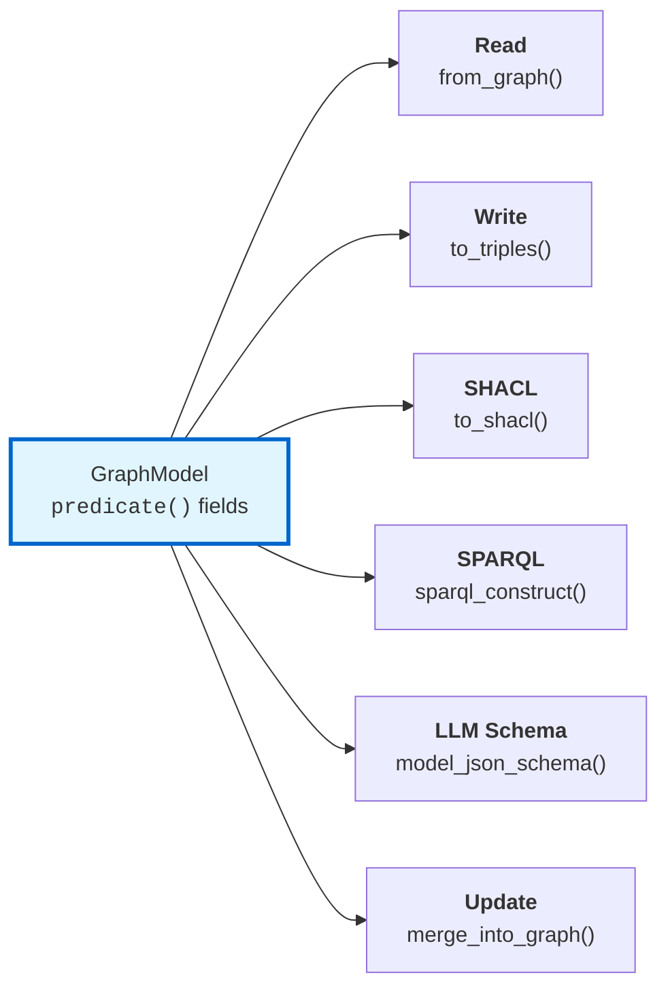

# rdfantic

[](https://pypi.org/project/rdfantic/)
[](https://pypi.org/project/rdfantic/)
[](LICENSE)

**Pydantic views for RDF graphs.** Define a model once — get read, write, SHACL validation, SPARQL generation, and LLM-ready JSON Schema. No glue code.



```python
from rdfantic import GraphModel, predicate
from rdflib import Namespace

SCHEMA = Namespace("http://schema.org/")

class PersonView(GraphModel):
    rdf_type = SCHEMA["Person"]
    name: str = predicate(SCHEMA["name"])
    email: str | None = predicate(SCHEMA["email"])
    knows: list[str] = predicate(SCHEMA["knows"])

# Read from any rdflib Graph
person = PersonView.from_graph(g, EX["alice"])

# Write back with proper XSD datatypes
g = person.to_graph(subject=EX["alice"])

# Generate SHACL shape + SPARQL query from the same model
shacl_graph = PersonView.to_shacl()
query = PersonView.sparql_construct()
```

## Why rdfantic?

Every Object-RDF Mapper (SuRF, RDFAlchemy, OWLReady2) copied the SQL pattern and failed because **RDF doesn't have tables**. The data is open-world, multi-typed, and schema-free.

rdfantic treats the model as a **view, not a table** — a typed lens that projects data out of a graph. Multiple views can read the same node. The graph stays the source of truth. Extra triples are ignored, not errors.

Three things converged that make this possible now:

1. **Pydantic** — mature validation and JSON Schema generation
2. **SHACL** — W3C standard for expressing graph constraints
3. **LLMs extracting structured data** — massive new use case that needs a schema-to-graph pipeline

## LLM extraction pipeline

The killer feature: one model drives the entire text-to-knowledge-graph pipeline.

```python
from rdfantic import GraphModel, predicate

class PersonView(GraphModel):
    rdf_type = SCHEMA["Person"]
    name: str = predicate(SCHEMA["name"])
    email: str | None = predicate(SCHEMA["email"])
    job_title: str | None = predicate(SCHEMA["jobTitle"])

# 1. JSON Schema for LLM structured output (no RDF metadata leaks)
schema = PersonView.model_json_schema()

# 2. LLM extracts structured data
response = client.responses.parse(
    model="gpt-4o-mini",
    input=[{"role": "user", "content": "Dr. Sarah Chen is a research scientist at DeepMind..."}],
    text_format=PersonView,
)
person = response.output_parsed

# 3. Write to RDF graph
g = person.to_graph(subject=EX["sarah-chen"])

# 4. Validate with SHACL shapes from the same model
from pyshacl import validate
conforms, _, _ = validate(g, shacl_graph=PersonView.to_shacl())
```

This pipeline currently takes 3-4 separate tools and custom glue. rdfantic collapses it to one model definition. See the [live example](examples/llm_bridge.ipynb).

## Install

```bash
pip install rdfantic
```

With SHACL validation:

```bash
pip install rdfantic[shacl]
```

Requires Python 3.14+.

## What one model gives you

| Capability | Method | What it does |
|-----------|--------|-------------|
| **Read** | `from_graph(g, subject)` | Extract matching triples into a validated Pydantic object |
| **Write** | `to_triples()` / `to_graph()` | Serialize back with proper XSD datatypes |
| **Update** | `merge_into_graph(g)` | Replace declared predicates, preserve everything else |
| **Delete** | `remove_from_graph(g, subject)` | Remove only model-declared predicates |
| **SHACL** | `to_shacl()` | Generate a SHACL NodeShape for graph validation |
| **SPARQL** | `sparql_construct()` | Generate a CONSTRUCT query for the model's shape |
| **Remote** | `from_endpoint(url, subject)` | Query a remote SPARQL endpoint directly |
| **Paginate** | `paginate(Model, g)` | `Page[Model]` for REST APIs (FastAPI-ready) |
| **LLM bridge** | `model_json_schema()` | Clean JSON Schema — no RDF metadata leaks |

## Nested models and depth control

Fields typed as another `GraphModel` follow object links recursively:

```python
class MovieView(GraphModel):
    rdf_type = SCHEMA["Movie"]
    name: str = predicate(SCHEMA["name"])
    director: PersonView = predicate(SCHEMA["director"])

movie = MovieView.from_graph(g, EX["inception"])
movie.director.name  # "Christopher Nolan"

# Bound recursion depth
movie = MovieView.from_graph(g, EX["inception"], max_depth=0)
movie.director  # None
```

## SHACL constraints

Use `Annotated` types for fine-grained SHACL metadata:

```python
from typing import Annotated
from rdfantic import SHConstraint

class StrictPerson(GraphModel):
    rdf_type = SCHEMA["Person"]
    name: Annotated[str, SHConstraint(min_length=1, max_length=200)] = predicate(SCHEMA["name"])
    age: Annotated[int, SHConstraint(min_inclusive=0, max_inclusive=150)] = predicate(SCHEMA["age"])
```

## FastAPI integration

```python
from fastapi import FastAPI
from rdfantic import Page, paginate

app = FastAPI()

@app.get("/movies", response_model=Page[MovieView])
def list_movies(offset: int = 0, limit: int = 10):
    return paginate(MovieView, graph, offset=offset, limit=limit)
```

## How it compares

| | Read graph→Python | Write Python→triples | Generate SHACL | Generate SPARQL | LLM bridge |
|---|:-:|:-:|:-:|:-:|:-:|
| **rdfantic** | ✓ | ✓ | ✓ | ✓ | ✓ |
| PydanticRDF | ✓ | ✓ | | | |
| OWLReady2 | ✓ | ✓ | | | |
| Pydontology | | ✓ | ✓ | | |
| RDFProxy | ✓ | | | | |
| RDFAlchemy | ✓ | ✓ | | | |

## Examples

Notebooks in [`examples/`](examples/) (outputs included):

- [basic_read_write.ipynb](examples/basic_read_write.ipynb) — define models, build graph, read, write, round-trip
- [update_delete.ipynb](examples/update_delete.ipynb) — open-world-safe update and delete
- [shacl_validation.ipynb](examples/shacl_validation.ipynb) — generate shapes, validate with pyshacl
- [multi_view.ipynb](examples/multi_view.ipynb) — two models reading the same node
- [pagination.ipynb](examples/pagination.ipynb) — `Page[Model]` with `paginate()`
- [llm_bridge.ipynb](examples/llm_bridge.ipynb) — live LLM extraction pipeline (OpenAI)

## Documentation

- [Getting Started](docs/getting-started.md) — full walkthrough
- [SHACL Constraints](docs/shacl.md) — `SHConstraint` reference
- [FastAPI Integration](docs/fastapi.md) — `Page[Model]` for REST APIs
- [Design](docs/design.md) — architecture and trade-offs
- [API Reference](docs/api.md) — complete method signatures

## License

MIT